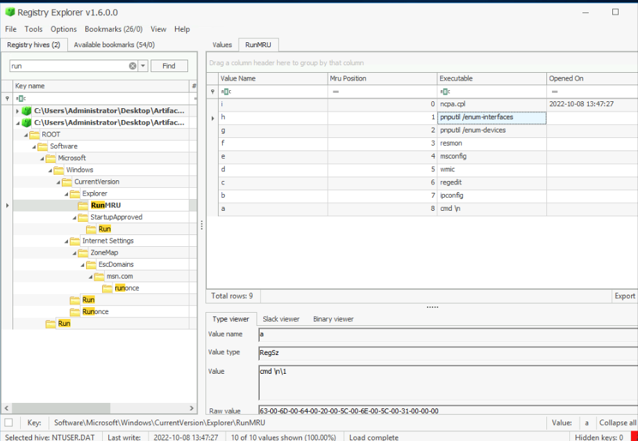

RunMRU is when a user enters a command into the START > Run prompt. Entries will be logged in the user hive under: Software\Microsoft\Windows\CurrentVersion\Explorer\RunMRU. The artifact numbers all entries with the most recent at reg_mtime starting at 0. Second recent 1, Third recent 2 etc.

PWD - C:\Users\Administrator\Desktop\Artifacts\NTUSER.DAT	

