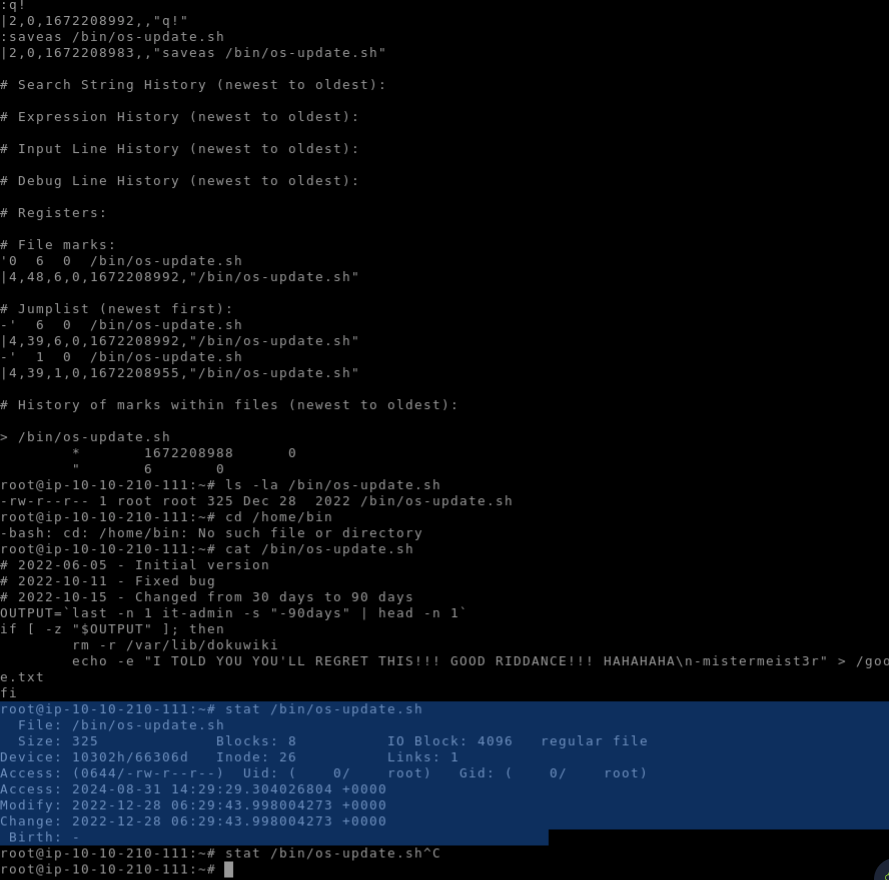

#Home directory is a personal directory assigned to a user on a Unix or Linux®-based system
cat /home/<directory>/.bash_history = full path 
"""eg: exit
ls -la
cat .bash_history
exit
sudo apt install dokuwiki
sudo rm /var/lib/dpkg/lock
sudo dpkg --configure -a
sudo lsof /var/lib/dpkg/lock
sudo lsof /var/lib/dpkg/lock-frontend
sudo rm /var/lib/dpkg/lock-frontend 
sudo dpkg --configure -a
sudo apt install dokuwiki
chown www-data:www-data /usr/share/dokuwiki
sudo chown www-data:www-data /usr/share/dokuwiki
chown www-data:www-data /usr/share/dokuwiki/* -R
sudo chown www-data:www-data /usr/sha
"""
#to find the authentication log
<platform>/var/log/auth.log
    vim /var/log/auth.log
#To exit  visudo
press ESC :q! <enter>

ls -la <file path> eg bin/os-update-sh
#to find the time, when modified Accessed  
stat <directory/fileName eg:(/bin/os-update.sh)

# pulls the request file <os-update.sh> from the bin directory
root@ip-10-10-210-111:~# cat /bin/os-update.sh

#incident-response-and-forensics <volatility>
ince Volatility is written purely in Python, it makes the installation steps and requirements very easy and universal for Windows, Linux, and Mac. If you already attempted to use Python on Windows and Mac, it is suggested to begin on Linux; however, all operating systems will work the same.

If you're using TryHackMe's AttackBox, Volatility is already present on the box, and you can skip these steps and move on.

Python logo

When downloading, you can make a choice to use the pre-packaged executable (.whl file) that will work the same and requires no dependencies (Windows Only), or you can decide to run it directly from Python.

To obtain a pre-packaged executable, simply download a zip file containing the application from their releases page. https://github.com/volatilityfoundation/volatility3/releases/tag/v1.0.1

To begin running the project from source, you will need to first download the following dependencies: Python 3.5.3 or later and Pefile 2017.8.1 or later. https://pypi.org/project/pefile/

You can also download these optional dependencies (recommended for this room): yara-python 3.8.0 or later https://github.com/VirusTotal/yara-python and capstone 3.0.0 or later https://www.capstone-engine.org/download.html.

Once you have your dependencies sorted, you can clone the repository from GitHub.

Command used: git clone https://github.com/volatilityfoundation/volatility3.git

You now have Volatility installed!

To test your installation run the vol.py file with the help parameter.

Command used: python3 vol.py -h

It is important to note that for any Linux or Mac memory files, you will need to download the symbol files from the Volatility GitHub. https://github.com/volatilityfoundation/volatility3#symbol-tables

Command lines
ow with Volatility3, you need to specify the operating system prior to specifying the plugin to be used, for example, windows.info vs linux.info. 
The most basic way of listing processes is using pslist; this plugin will get the list of processes from the doubly-linked list that keeps track of processes in memory, equivalent to the process list in task manager. The output from this plugin will include all current processes and terminated processes with their exit times.

Syntax: python3 vol.py -f <file> windows.pslist

Some malware, typically rootkits, will, in an attempt to hide their processes, unlink itself from the list. By unlinking themselves from the list you will no longer see their processes when using pslist. To combat this evasion technique, we can use psscan;this technique of listing processes will locate processes by finding data structures that match _EPROCESS. While this technique can help with evasion countermeasures, it can also cause false positives.

Syntax: python3 vol.py -f <file> windows.psscan

The third process plugin, pstree, does not offer any other kind of special techniques to help identify evasion like the last two plugins; however, this plugin will list all processes based on their parent process ID, using the same methods as pslist. This can be useful for an analyst to get a full story of the processes and what may have been occurring at the time of extraction.

Syntax: python3 vol.py -f <file> windows.pstree

Now that we know how to identify processes, we also need to have a way to identify the network connections present at the time of extraction on the host machine. netstat will attempt to identify all memory structures with a network connection.

Syntax: python3 vol.py -f <file> windows.netstat

This command in the current state of volatility3 can be very unstable, particularly around old Windows builds. To combat this, you can utilize other tools like bulk_extractor to extract a PCAP file from the memory file. In some cases, this is preferred in network connections that you cannot identify from Volatility alone. https://tools.kali.org/forensics/bulk-extractor

The last plugin we will cover is dlllist. This plugin will list all DLLs associated with processes at the time of extraction. This can be especially useful once you have done further analysis and can filter output to a specific DLL that might be an indicator for a specific type of malware you believe to be present on the system.

Syntax: python3 vol.py -f <file> windows.dlllist